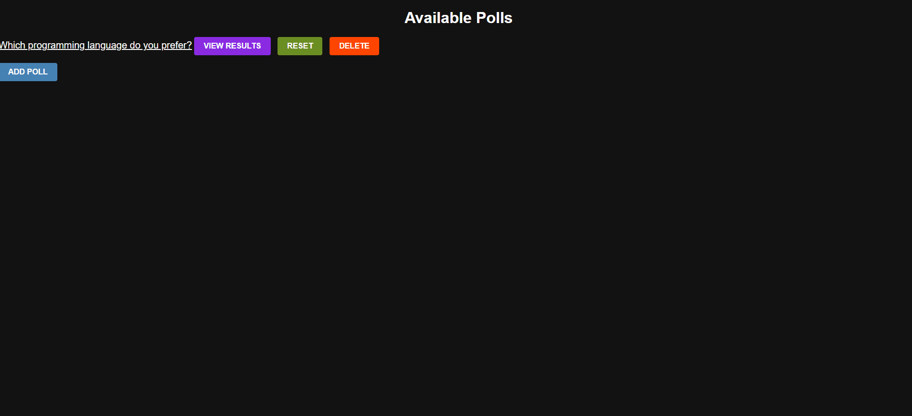

# Poll Project 🗳️

A dynamic, user-friendly poll application built with Django!  
Create, vote, and view real-time poll results—all in a clean and intuitive interface.

  


Welcome! This project is a fully functional poll app where users can:
- Browse available polls
- Vote on their preferred options
- Instantly see updated poll results

Ideal for learning Django basics, exploring web app structure, and practicing your Python back-end skills.  
Feel free to extend or customize it for your own needs! 😎

---

## 🏆 Features

- Simple, modern poll voting interface 🗳️  
- Real-time result updates 📊  
- Django-powered admin panel for poll management ⚙️  
- Clean, modular project structure 🗂️  
- Responsive and easy to use across devices 📱💻  

---

## 🛠️ Getting Started

### Prerequisites

- Python 3.x  
- Django (see `requirements.txt` if available)  

### Installation

1. **Clone the repository:**  
   ```bash
   git clone https://github.com/Gowtham-Moorthi/Poll-Project.git
   ```
2. **Go to the project folder:**  
   ```bash
   cd Poll-Project
   ```
3. **Install dependencies:**  
   ```bash
   pip install django
   ```
4. **Apply migrations:**  
   ```bash
   python manage.py migrate
   ```
5. **Run the development server:**  
   ```bash
   python manage.py runserver
   ```
6. **Open your browser and visit:**  
   [http://127.0.0.1:8000/](http://127.0.0.1:8000/)

---

## 📂 Project Structure

```
Poll-Project/
├── assets/             # Demo GIFs and static assets 🌠
├── poll_project/       # Django project configuration ⚙️
├── polls/              # Main app: models, views, templates 🗂️
├── db.sqlite3          # SQLite database 💾
├── manage.py           # Django project manager 🛠️
└── README.md           # Project documentation 📘
```

---

## 🤝 Contributing

All contributions are welcome!  
Got ideas? Found a bug? Want to add a feature?  
1. Fork the repo 🍴  
2. Create your branch (`git checkout -b feature/YourFeature`)  
3. Commit your changes (`git commit -am 'Add new feature'`)  
4. Push to your branch (`git push origin feature/YourFeature`)  
5. Open a Pull Request 🚀  

---

## 📜 License

This project is for educational purposes only.  
Feel free to use, remix, and share! 🎉

---

## 👤 About Me

Created by [Gowtham Moorthi](https://github.com/Gowtham-Moorthi) 👋  
Connect with me on [LinkedIn](https://www.linkedin.com/in/gowtham-moorthi/) 🔗

---

> ⭐️ _If you like this project, give it a star!_  
> 🛠️ _Happy Coding!_  
> ❤️ _Keep building, keep learning!_

